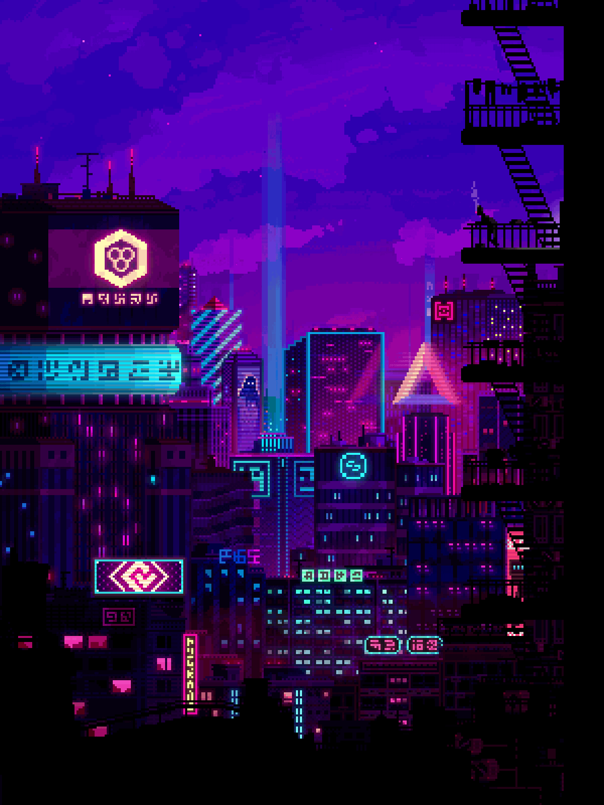

<!-- Animated Typing Intro -->
<!-- https://github.com/denvercoder1/readme-typing-svg -->

  
  
  

<!-- Personal Introduction -->

<h2 align="center"> Curious Learner  Relentless Problem-Solver</h2> 

- 👋 I'm Kendrick (DragonSenses), a Software Developer with a background in computer engineering.  

- 🌱 I’m currently learning AI and ML concepts, especially those applicable to automation, recommendation systems.  

- 🾠I’m looking to network and make friends here!  

- 🯠Goals: Learn AI, Machine Learning, and Cybersecurity; and Contribute to Open Source Projects.  

- 🵠Interests: Fitness, Science, Math, RPGs, and Coding.  

- 📖 Hobbies: Exercise, Cooking, Reading, Writing, and Building Computers

  > Occasionally enjoy anime, manga, or light novels—and engineering complex production lines in _Factorio_.

- 📜 Favorite Book: <a src="https://algorithmstoliveby.com/">Algorithms to Live By</a> by Brian Christian and Tom Griffiths   > _An exploration on how computer science principles can improve daily decision-making._

<h2></h2>

<!-- Tech Stack - Skills, Languages, Frameworks, and Tools -->
<!-- https://github.com/anuraghazra/github-readme-stats -->
<!-- https://github.com/tandpfun/skill-icons -->

  
  

  <h2><strong> ⚙️ Technologies and Skills </strong></h2>
   
  
  
   

  <h3><strong> Languages, Frameworks, and Tools </strong></h3>

  

<h2></h2>

<!-- GitHub Statistics -->
<!-- https://github.com/denvercoder1/github-readme-streak-stats -->

  <h2> 📊 My Github Stats </h2> 
  

  

<h2></h2>

<!-- Projects -->
<!-- https://github.com/anuraghazra/github-readme-stats -->

  <h2 align="center"> 🛠️ Projects </h2> 

  <!-- Project List -->

  
  

